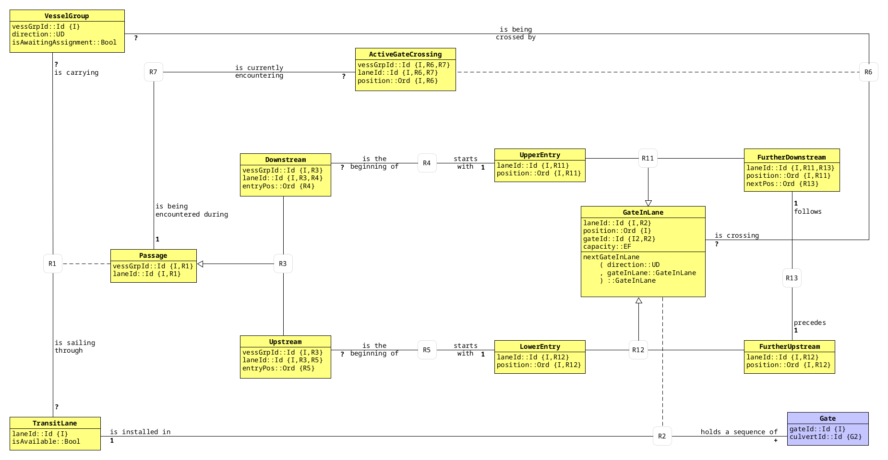
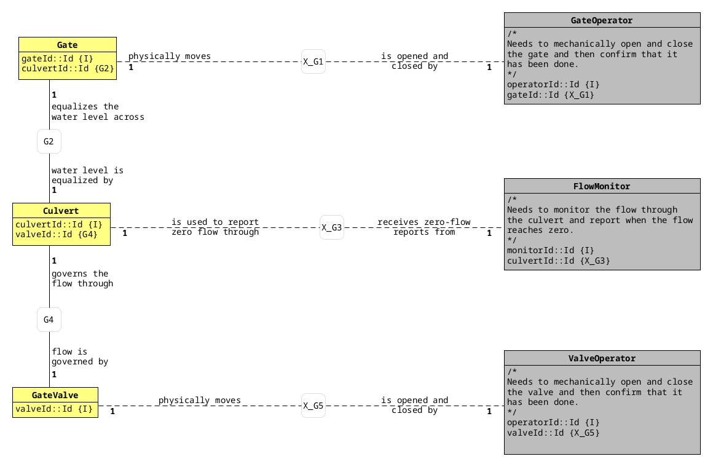
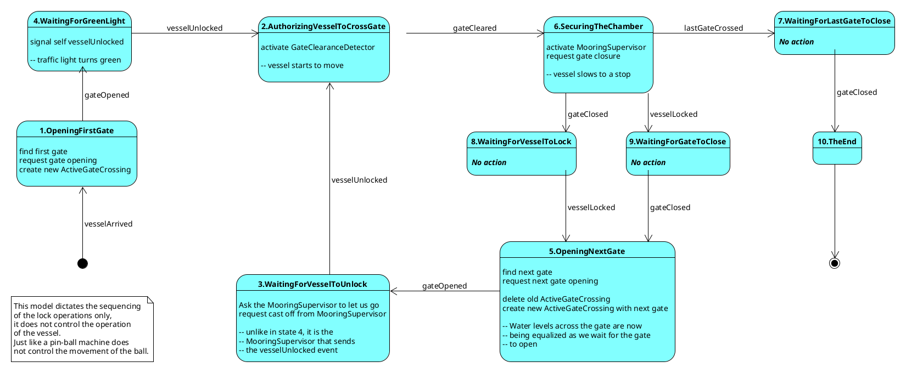
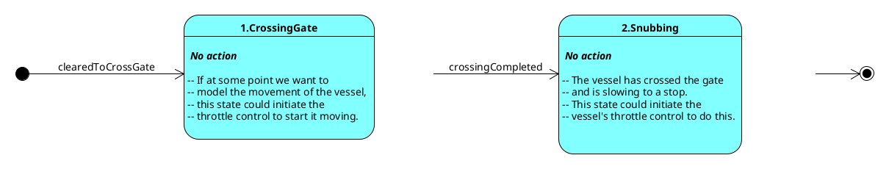
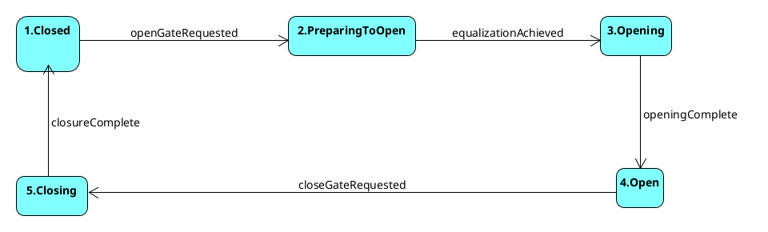
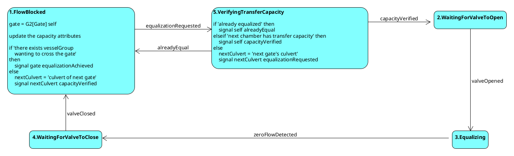
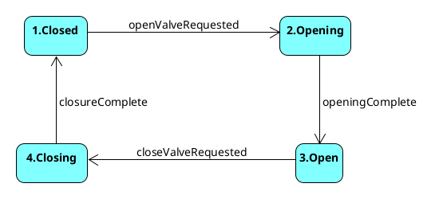
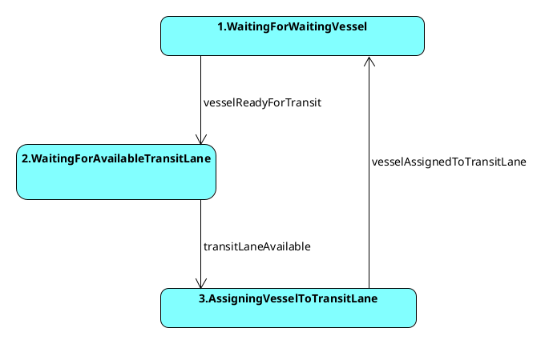

## Introduction

<!--
These functions are used to automatically convert Umlet files for inclusion in the
document.
-->

```{.tcl results=hide eval=1 echo=0}
# eg, needsUpdate foo.png foo.uxf
proc needsUpdate {dep_file indep_file} {
    set dep_mtime [expr {[file exists $dep_file] ? [file mtime $dep_file] : 0}]
    set indep_mtime [file mtime $indep_file]
    return [expr {($indep_mtime > $dep_mtime) ? "true" : "false"}]
}

proc convertUmletFile {input output {format png}} {
    exec -- umlet -action=convert -format=$format -filename=$input -output=$output > /dev/null
}
```


This document is a literate program containing the translation of a set of xUML domains
using the
[Rosea](https://repos.modelrealization.com/cgi-bin/fossil/mrtools/wiki?name=RoseaPage)
translation tool.
As a literate program,
all code for the implementation is included directly in this document.

The purpose of the resulting translation is to provide a stand alone system that runs
the
[WETS](https://andrewm@chiselapp.com/user/polygame/repository/WETSystem)
domain.
The WETS domain model was created by Paul Higham and
models locks in a canal.
It was inspired by the Hiram H. Chittenden locks
located in Seattle, Washington.

One other domain has been constructed to provide simulated client services to
the WETS domain.

Mechanical Management
 ~ This domain provides simulated operation of the physical equipment that is necessary
    to control the flow of boats and water to transfer boats between levels in a canal.

The following diagram is a domain chart for the three domains.

```{.dot label=WETS_System_Domains fig=true}
digraph WETS_System_Domains {
    node[style=filled, fillcolor=yellow]

    "WETS" -> "Mechanical\nManagement"
}
```

## WETS Domain Translation

For convenience,
the class diagrams for the WETS domain are included below.
The domain consists of two subsystems, Transit and Gate Operation.
The following diagram is the class model for the Transit subsystem.

```{.tcl results="asis" eval=1 echo=0}
if {[needsUpdate ./images/cm.transit.png ../../FormalModels/cm.transit.uxf]} {
    convertUmletFile ../../FormalModels/cm.transit.uxf ./images/cm.transit
}
return {}
```

The following diagram is the class model for the Gate Operation subsystem.

```{.tcl results="asis" eval=1 echo=0}
if {[needsUpdate ./images/cm.gateOperation.png ../../FormalModels/cm.gateOperation.uxf]} {
    convertUmletFile ../../FormalModels/cm.gateOperation.uxf ./images/cm.gateOperation
}
return {}
```

The WETS domain is translated to running code using the Rosea xUML translation tool.
The resulting implementation is in the
[Tcl](https://www.tcl-lang.org/) language.

Like all xUML domain, the WETS domain consists of classes, relationships, and a few other
less frequently used constructs.

```{#wets-domain}
domain wets {
    <<vessel-group-class>>
    <<transit-lane-class>>
    <<passage-class>>
    <<upstream-class>>
    <<downstream-class>>
    <<gate-in-lane-class>>
    <<active-gate-crossing>>
    <<upper-entry-class>>
    <<further-downstream-class>>
    <<gate-class>>
    <<culvert-class>>
    <<gate-valve-class>>

    <<associations>>
    <<generalizations>>
    assigner R1 {
        <<R1-assigner>>
    }
    <<domain-operations>>
}
```

## WETS Class Model Translation

The translation presented here starts by defining the data of the classes.
In a separate section,
any state model associated with the class is presented.
We do not describe the classes here.
The xUML model of the WETS domain is contained in a domain workbook and has
all the information required.

It is worth noting that the Rosea domain specific language (DSL) contains
constructs that have a direct mapping from the various UML diagrams used
to capture the domain specification.
For example, attributes marked as identifiers with the `{I}` notation
are described by the `-id` option to the `attribute` command.
Of particular importance are referential attributes denoted with `{Rx}` notation.
These are specified to Rosea using the `reference` command.

### Vessel Group

```{#vessel-group-class .tcl}
class VesselGroup {
    attribute vessGrpId int -id 1 -system 1
    attribute direction string\
        -check {$direction eq "Upstream" || $direction eq "Downstream"}
    attribute isAwaitingAssignment boolean -default true
}
```

### Transit Lane

```{#transit-lane-class .tcl}
class TransitLane {
    attribute laneId int -id 1 -system 1
    attribute isAvailable boolean -default true
}
```

### Passage

```{#passage-class .tcl}
class Passage {
    attribute vessGrpId int -id 1
    attribute laneId int -id 1
    reference R1 VesselGroup -link vessGrpId
    reference R1 TransitLane -link laneId

    statemodel {
        <<passage-state-model>>
    }
}
```

### Downstream

```{#downstream-class .tcl}
class Downstream {
    attribute vessGrpId int -id 1
    attribute laneId int -id 1
    attribute entryPos int

    reference R3 Passage -link vessGrpId -link laneId
    reference R4 UpperEntry -link laneId -link {entryPos position}
}
```

### Upstream

```{#upstream-class .tcl}
class Upstream {
    attribute vessGrpId int -id 1
    attribute laneId int -id 1
    attribute entryPos int

    reference R3 Passage -link vessGrpId
    reference R3 Passage -link laneId
    reference R5 LowerEntry -link laneId
    reference R5 LowerEntry -link {entryPos position}
}
```

### Active Gate Crossing

```{#active-gate-crossing .tcl}
class ActiveGateCrossing {
    attribute vessGrpId int -id 1
    attribute laneId int -id 1
    attribute position int -id 1

    reference R6 VesselGroup -link vessGrpId
    reference R6 GateInLane -link laneId -link position
    reference R7 Passage -link vessGrpId -link laneId

    statemodel {
        <<active-gate-crossing-state-model>>
    }
}
```

### Upper Entry

```{#upper-entry-class .tcl}
class UpperEntry {
    attribute laneId int -id 1
    attribute position int -id 1

    reference R11 GateInLane -link laneId -link position
}
```

### Lower Entry

```{#upper-entry-class .tcl}
class LowerEntry {
    attribute laneId int -id 1
    attribute position int -id 1

    reference R12 GateInLane -link laneId -link position
}
```

### Gate In Lane

```{#gate-in-lane-class .tcl}
class GateInLane {
    attribute laneId int -id 1
    attribute position int -id 1
    attribute gateId int -id 2 -system 1
    attribute capacity string -default Empty -check {$capacity eq "Empty" || $capacity eq "Full"}
    attribute inService boolean -default true

    reference R2 TransitLane -link laneId
    reference R2 Gate -link gateId

    <<gate-in-lane-instance-ops>>
}
```

```{#gate-in-lane-instance-ops .tcl}
instop nextGateInLane {direction} {
    return [expr {($direction eq "Upstream") ?\
        [findRelated $self {~R11 FurtherDownstream} R13 R12] :\
        [findRelated $self {~R12 FurtherUpstream} ~R13 R11]}]
}
```

### Further Downstream

```{#further-downstream-class .tcl}
class FurtherDownstream {
    attribute laneId int -id 1
    attribute position int -id 1
    attribute nextPos int

    reference R11 GateInLane -link laneId -link position
    reference R13 FurtherUpstream -link laneId -link {nextPos position}
}
```

### Further Upstream

```{#further-downstream-class .tcl}
class FurtherUpstream {
    attribute laneId int -id 1
    attribute position int -id 1

    reference R12 GateInLane -link laneId -link position
}
```

### Gate

```{#gate-class .tcl}
class Gate {
    attribute gateId int -id 1
    attribute culvertId int

    reference G2 Culvert -link culvertId

    statemodel {
        <<gate-state-model>>
    }
}
```

### Culvert

```{#culvert-class .tcl}
class Culvert {
    attribute culvertId int -id 1 -system 1
    attribute valveId int

    reference G4 GateValve -link valveId

    statemodel {
        <<culvert-state-model>>
    }
}
```

### Gate Valve

```{#gate-valve-class .tcl}
class GateValve {
    attribute valveId int -id 1 -system 1

    statemodel {
        <<gate-valve-state-model>>
    }
}
```

### Associations

```{#associations .tcl}
association R1 VesselGroup ?--? TransitLane -associator Passage
association R2 Gate +--1 TransitLane  -associator GateInLane
association R4 Downstream ?--1 UpperEntry
association R5 Upstream ?--1 LowerEntry
association R6 GateInLane ?--? VesselGroup -associator ActiveGateCrossing
association R7 ActiveGateCrossing ?--1 Passage
association R13 FurtherDownstream 1--1 FurtherUpstream
association G2 Gate 1--1 Culvert
association G4 Culvert 1--1 GateValve
```

### Generalizations

```{#generalizations .tcl}
generalization R3 Passage\
    Upstream\
    Downstream
generalization R11 GateInLane\
    UpperEntry\
    FurtherDownstream
generalization R12 GateInLane\
    LowerEntry\
    FurtherUpstream
```

## WETS State Model Translation

In this section,
the state models associated with those classes that have a life-cycle are given.
Again the transcription from the state model graphic is direct.
For convenience in performing the translation,
the UML state model diagram is included.
This is the same state model that can be found in the domain workbook
for the WETS domain.
Note also that xUML uses only simple Moore type state models and thus the
complexity of full-blown hierarchical state models that UML allows is
avoided.

### Passage

```{.tcl results="asis" eval=1 echo=0}
if {[needsUpdate ./images/sm.transit.passage.png ../../FormalModels/sm.transit.passage.uxf]} {
    convertUmletFile ../../FormalModels/sm.transit.passage.uxf ./images/sm.transit.passage
}
return {}
```

```{#passage-state-model .tcl}
initialstate OpeningFirstGate
defaulttrans CH
terminal TheEnd

transition @ - vesselArrived -> OpeningFirstGate

transition OpeningFirstGate - gateOpened -> WaitingForGreenLight

transition WaitingForGreenLight - vesselUnlocked -> AuthorizingVesselToCrossGate

transition AuthorizingVesselToCrossGate - gateCleared -> SecuringTheChamber

transition SecuringTheChamber - gateClosed -> WaitingForVesselToLock
transition SecuringTheChamber - vesselLocked -> WaitingForGateToClose
transition SecuringTheChamber - lastGateCrossed -> WaitingForLastGateToClose

transition WaitingForVesselToLock - vesselLocked -> OpeningNextGate

transition WaitingForGateToClose - gateClosed -> OpeningNextGate

transition OpeningNextGate - gateOpened -> WaitingForVesselToUnlock

transition WaitingForVesselToUnlock - vesselUnlocked -> AuthorizingVesselToCrossGate

transition WaitingForLastGateToClose - gateClosed -> TheEnd
```

```{#passage-state-model}
# 1.  OpeningFirstGate
#
# vessel = R1[VesselGroup] self
# if vessel.direction == Upstream
# then entryGateInLane = ( R12[GateInLane]
#   . R5
#   . R3[Upstream]
#   ) self
# else entryGateInLane = ( R11[GateInLane]
#   . R4
#   . R3[Downstream]
#   ) self
# ActiveGateCrossing createasync clearedToCrossGate
#   vesselGrpId = self.vesselGrpId
#   laneId = self.laneId
#   position = entryGateInLane.position
# entryGate = R2[Gate] entryGateInLane
# signal entryGate openGateRequested
```

```{#passage-state-model .tcl}
state OpeningFirstGate {} {
    set vessel [findRelated $self {~R1 VesselGroup}]
    if {[readAttribute $vessel direction] eq "Upstream"} {
        set entryGateInLane [findRelated $self {~R3 Upstream} R5 R12]
    } else {
        set entryGateInLane [findRelated $self {~R3 Downstream} R4 R11]
    }
    ActiveGateCrossing createasync clearedToCrossGate {}\
        vessGrpId [readAttribute $vessel vessGrpId]\
        laneId [readAttribute $entryGateInLane laneId]\
        position [readAttribute $entryGateInLane position]

    set entryGate [findRelated $entryGateInLane ~R2]
    signal $entryGate openGateRequested
}
```

```{#passage-state-model}
#4. WaitingForGreenLight
# signal self vesselUnlocked
```

```{#passage-state-model .tcl}
state WaitingForGreenLight {} {
    signal $self vesselUnlocked
}
```

```{#passage-state-model}
# 2. AuthorizingVesselToCrossGate
# vessel = R1[VesselGroup] self
# signal vessel clearedToCrossGate
#
# // We invoke the services of an external entity here to tell us
# // when a vessel has crossed out of the region in which
# // it may interfere with the closing of the gate.
#
# crossingGate =
#     ( R6[GateInLane]
#     . R7
#     ) self
#
#
# O> { Target : startMonitoring(X_G7 crossingGate)
#     , Expectation : that the targeted GateClearanceDetector will inform
#         the Passage when the vesselGroup has moved out of
#         the exclusion zone.
#     , TransferVector
#         { instance : self
#         , eventName : gateCleared
#         }
#     }
```

```{#passage-state-model .tcl}
state AuthorizingVesselToCrossGate {} {
    set crossingGate [findRelated $self ~R7 ~R6]
    wormhole WETS01_monitor_gate_signal_gateCleared\
        [identifier $crossingGate 2]\
        [identifier $self]

}
```

```{#passage-state-model}
#6. SecuringTheChamber
#
# vessel            = R1[VesselGroup] self
# currentGateInLane = R6[GateInLane] vessel
# currentGate       = R2[Gate] currentGateInLane
#
# signal currentGate closeGateRequested
#
# nextGateInLane    = nextGateInLane(vessel.direction, currentGateInLane)
#
# if empty nextGateInLane then
#     // We must have crossed the last gate, so there is no need
#     // to moor the vessel.
#     signal self lastGateCrossed
# else
#     // To find the chamber where mooring must take place,
#     // our choices made the chamber be indexed by its
#     // downstream gate. If the vessel is transiting upstream,
#     // this gate is the one that the vessel has just crossed;
#     // otherwise it is the next one downstream.
#     if vessel.direction == Upstream
#     then mooringChamber = currentGateInLane
#     else mooringChamber = nextGateInLane
#
#     // Activate the MooringSupervisor to report the mooring
#     // of a vessel group.
#     O>  { Target : lockRequested(X_G9 mooringChamber)
#         , Expectation : that the targeted MooringSupervisor will
#                         notify the Passage when the vessel has
#                         been locked to the chamber.
#         , TransferVector
#             { instance : self
#             , eventName : vesselLocked
#             }
#         }
# endif
```

```{#passage-state-model .tcl}
state SecuringTheChamber {} {
    set vessel [findRelated $self {~R1 VesselGroup}]
    set currentGateInLane [findRelated $vessel ~R6]
    set currentGate [findRelated $currentGateInLane ~R2]

    signal $currentGate closeGateRequested

    set nextGateInLane [instop $currentGateInLane nextGateInLane [readAttribute $vessel direction]]

    if {[isEmptyRef $nextGateInLane]} {
        signal $self lastGateCrossed
    } else {
        set mooringChamber [expr {([readAttribute $vessel direction] eq "Upstream") ?\
            $currentGateInLane : $nextGateInLane}]

        wormhole WETS03_mooring_supervisor_lock_requested\
            [identifier $mooringChamber 2]\
            [identifier $self]
    }
}
```

```{#passage-state-model}
#7. WaitingForLastGateToClose
```

```{#passage-state-model .tcl}
state WaitingForLastGateToClose {} {} ; # empty
```

```{#passage-state-model}
#8. WaitingForVesselToLock
```

```{#passage-state-model .tcl}
state WaitingForVesselToLock {} {} ; # empty
```

```{#passage-state-model}
#9. WaitingForGateToClose
```

```{#passage-state-model .tcl}
state WaitingForGateToClose {} {} ; # empty
```

```{#passage-state-model}
# 5. OpeningNextGate
#
# vessel            = R1[VesselGroup] self
# currentGateInLane = R6[GateInLane] vessel
# nextGateInLane    = nextGateInLane(vessel.direction currentGateInLane)
# nextGate          = R2[Gate] nextGateInLane
#
# // We wouldn't have ended up in this state if there was no next gate
# // to encounter, so we know it exists.
# signal nextGate openGateRequested
#
# // update the ActiveGateCrossing to the new gate by retiring
# // the old one and creating a new one
# signal (R7 self) crossingCompleted
#
# ActiveGateCrossing createasync clearedToCrossGate
#     vesselGrpId = vessel.vesselGrpId
#     laneId      = nextGateInLane.laneId
#     position    = nextGateInLane.position
```

```{#passage-state-model .tcl}
state OpeningNextGate {} {
    set vessel [findRelated $self {~R1 VesselGroup}]
    set currentGateInLane [findRelated $vessel ~R6]
    set nextGateInLane [instop $currentGateInLane nextGateInLane [readAttribute $vessel direction]]
    set nextGate [findRelated $nextGateInLane ~R2]

    signal $nextGate openGateRequested

    set active_gate_crossing [findRelated $self ~R7]
    signal $active_gate_crossing crossingCompleted

    ActiveGateCrossing createasync clearedToCrossGate {}\
        vessGrpId [readAttribute $vessel vessGrpId]\
        laneId [readAttribute $nextGateInLane laneId]\
        position [readAttribute $nextGateInLane position]
}
```

```{#passage-state-model}
# 3. WaitingForVesselToUnlock
# vessel            = R1[VesselGroup] self
# currentGateInLane = R6[GateInLane] vessel
#
# if vessel.direction == Downstream
# then mooringChamber = currentGateInLane
# else mooringChamber = nextGateInLane(Downstream currentGateInLane)
#
# O>  { Target : releaseRequested(X_G9 mooringChamber)
#     , Expectation : that the targeted MooringSupervisor will
#                     notify the Passage when the vessel is cast off.
#     , TransferVector
#         { instance : self
#         , eventName : vesselUnlocked
#         }
#     }
```

```{#passage-state-model .tcl}
state WaitingForVesselToUnlock {} {
    set vessel [findRelated $self {~R1 VesselGroup}]
    set currentGateInLane [findRelated $vessel ~R6]

    set mooringChamber [expr {([readAttribute $vessel direction] eq "Downstream") ?\
        $currentGateInLane :\
        [instop $currentGateInLane nextGateInLane Downstream]}]

    wormhole WETS10_mooring_supervisor_release_requested\
        [identifier $mooringChamber 2]\
        [identifier $self]
}
```

```{#passage-state-model}
#10. TheEnd
# transitLane = R1[TransitLane] self
# transitLane.isAvailable = True
# R1 signal transitLaneAvailable
#
# signal (R7 self) crossingCompleted
# delete ~R3[Upstream] self
# delete ~R3[Downstream] self
# delete  R1[VesselGroup] self
```

```{#passage-state-model .tcl}
state TheEnd {} {
    set transitLane [findRelated $self R1]
    updateAttribute $transitLane isAvailable true
    R1 signal transitLaneAvailable

    signal [findRelated $self ~R7] crossingCompleted
    delete [findRelated $self {~R3 Upstream}]
    delete [findRelated $self {~R3 Downstream}]
    delete [findRelated $self ~R1]
}
# TheEnd is a terminal state.
```

### Active Gate Crossing

```{.tcl results="asis" eval=1 echo=0}
if {[needsUpdate ./images/activeGateCrossing.png ../../FormalModels/sm.transit.activeGateCrossing.uxf]} {
    convertUmletFile ../../FormalModels/sm.transit.activeGateCrossing.uxf ./images/activeGateCrossing
}
return {}
```

```{#active-gate-crossing-state-model .tcl}
initialstate CrossingGate
defaulttrans CH
terminal Snubbing

transition @ - clearedToCrossGate -> CrossingGate
transition CrossingGate - crossingCompleted -> Snubbing

state CrossingGate {} {} ; # empty
state Snubbing {} {} ; # empty
```

### Gate

```{.tcl results="asis" eval=1 echo=0}
if {[needsUpdate ./images/sm.gateOperation.gate.png ../../FormalModels/sm.gateOperation.gate.uxf]} {
    convertUmletFile ../../FormalModels/sm.gateOperation.gate.uxf ./images/sm.gateOperation.gate
}
return {}
```

```{#gate-state-model .tcl}
initialstate Closed
defaulttrans CH

transition Closed - openGateRequested -> PreparingToOpen
transition PreparingToOpen - equalizationAchieved -> Opening
transition Opening - openingComplete -> Open
transition Open - closeGateRequested -> Closing
transition Closing - closureComplete -> Closed
```

```{#gate-state-model}
# 1. Closed
# passage = (R1[Passage] . R2) self
# signal passage gateClosed
```

```{#gate-state-model .tcl}
state Closed {} {
    set passage [findRelated $self R2 {~R1 Passage}]
    signal $passage gateClosed
}
```

```{#gate-state-model}
# 2. PreparingToOpen
# culvert = G2 self
# signal culvert equalizationRequested
```

```{#gate-state-model .tcl}
state PreparingToOpen {} {
    set culvert [findRelated $self G2]
    signal $culvert equalizationRequested
}
```

```{#gate-state-model}
# 3. Opening
# X_signal (X_G1 self) startOpening
```

```{#gate-state-model .tcl}
state Opening {} {
    wormhole WETS04_open_gate_signal_openingComplete [identifier $self]
}
```

```{#gate-state-model}
# 4. Open
# passage =
#     ( R1[Passage]
#     . R2[TransitLane]
#     ) self
# signal passage gateOpened
```

```{#gate-state-model .tcl}
state Open {} {
    set passage [findRelated $self R2 {~R1 Passage}]
    signal $passage gateOpened
}
```

```{#gate-state-model}
# 5. Closing
# X_signal (X_G1 self) startClosing
```

```{#gate-state-model .tcl}
state Closing {} {
    wormhole WETS05_close_gate_signal_closureComplete [identifier $self]
}
```

### Culvert

```{.tcl results="asis" eval=1 echo=0}
if {[needsUpdate ./images/sm.gateOperation.culvert.png ../../FormalModels/sm.gateOperation.culvert.uxf]} {
    convertUmletFile ../../FormalModels/sm.gateOperation.culvert.uxf ./images/sm.gateOperation.culvert
}
return {}
```

```{#culvert-state-model .tcl}
initialstate FlowBlocked ; # not indicated on state diagram
defaulttrans CH

transition FlowBlocked - equalizationRequested -> VerifyingTransferCapacity

transition VerifyingTransferCapacity - capacityVerified -> WaitingForValveToOpen
transition VerifyingTransferCapacity - alreadyEqual -> FlowBlocked

transition WaitingForValveToOpen - valveOpened -> Equalizing

transition Equalizing - zeroFlowDetected -> WaitingForValveToClose

transition WaitingForValveToClose - valveClosed -> FlowBlocked
```

```{#culvert-state-model}
# 1. FlowBlocked
# gate = G2[Gate] self
#
#
# // This action cannot be executed without the state machine first having
# // received the equalizationRequested event. The only way that can have
# // happened is if there is a vessel in the transit lane.
#
# currentGateInLane   = R2[GateInLane] gate
# vesselWaitingAtGate = notEmpty(R6[VesselGroup] currentGateInLane)
#
# if vesselWaitingAtGate then
#     // this is the gate that needs to know about the equalization,
#     // since it must have been the source of the original request
#
#     signal gate equalizationAchieved
# else
#     // Find the culvert belonging to the next gate in the opposite
#     // direction of that of the vessel's travel and inform it that
#     // there is now enough capacity for it to be able to equalize.
#     // We call this the returnCulvert.
#
#     transitingVessel =
#         ( R1[VesselGroup]
#         . R2[TransitLane]
#         ) gate
#
#     if transitingVessel.direction === Upstream
#     then returnDirection = Downstream
#     else returnDirection = Upstream
#
#     returnCulvert =
#         ( G2[Culvert]
#         . R2[Gate]
#         ) nextGateInLane
#             ( returnDirection
#             , currentGateInLane
#             )
#
#     signal returnCulvert capacityVerified
# endif
```

```{#culvert-state-model .tcl}
state FlowBlocked {} {
    set gate [findRelated $self ~G2]
    set currentGateInLane [findRelated $gate {R2 GateInLane}]
    set waitingVessel [findRelated $currentGateInLane R6]

    if {[isNotEmptyRef $waitingVessel]} {
        signal $gate equalizationAchieved
    } else {
        set transitingVessel [findRelated $gate R2 ~R1]
        set returnDirection [expr {\
            ([readAttribute $transitingVessel direction] eq "Upstream") ?\
            "Downstream" : "Upstream"}]
        set nextGateInLane [instop $currentGateInLane nextGateInLane $returnDirection]
        set returnCulvert [findRelated $nextGateInLane {~R2 Gate} G2]
        signal $returnCulvert capacityVerified
    }
}
```

```{#culvert-state-model}
# 2. WaitingForValveToOpen
# X_signal (X_G4 self) openValveRequested
```

```{#culvert-state-model .tcl}
state WaitingForValveToOpen {} {
    set valve [findRelated $self G4]
    signal $valve openValveRequested
}
```

```{#culvert-state-model}
# 3. Equalizing
# X_signal (X_G3 self) startMonitoring
```

```{#culvert-state-model .tcl}
state Equalizing {} {
    wormhole WETS06_monitor_flow_signal_zeroFlowDetected [identifier $self]
}
```

```{#culvert-state-model}
# 4. WaitingForValveToClose
# currentGateInLane =
#     ( R2[GateInLane]
#     . G2[Gate]
#     ) self
#
# downstreamGateInLane =
#     nextGateInLane(Downstream, currentGateInLane)
#
# isUpperEntry = notEmpty (R11[UpperEntry] currentGateInLane)
# isLowerEntry = notEmpty (R12[LowerEntry] currentGateInLane)
#
# if isUpperEntry then
#     // we can count on there being a downstreamGateInLane
#     downstreamGateInLane.capacity = Full
# elseif isLowerEntry then
#     currentGateInLane.capacity    = Empty
# else // we're at an intermediate gate
#     downstreamGateInLane.capacity = Full
#     currentGateInLane.capacity    = Empty
#
# signal (G4 self) closeValveRequested
```

```{#culvert-state-model .tcl}
state WaitingForValveToClose {} {
    set currentGateInLane [findRelated $self ~G2 {R2 GateInLane}]
    set downstreamGateInLane [instop $currentGateInLane nextGateInLane Downstream]
    set isUpperEntry [isNotEmptyRef [findRelated $currentGateInLane {~R11 UpperEntry}]]
    set isLowerEntry [isNotEmptyRef [findRelated $currentGateInLane {~R12 LowerEntry}]]

    if {$isUpperEntry} {
        updateAttribute $downstreamGateInLane capacity Full
    } elseif {$isLowerEntry} {
        updateAttribute $currentGateInLane capacity Empty
    } else {
        updateAttribute $downstreamGateInLane capacity Full
        updateAttribute $currentGateInLane capacity Empty
    }

    set valve [findRelated $self G4]
    signal $valve closeValveRequested
}
```

```{#culvert-state-model}
# 5. VerifyingTransferCapacity
# currentGateInLane =
#     ( R2[GateInLane]
#     . G2[Gate]
#     ) self
#
# // if 'next chamber has transfer capacity'
# // where 'chamber' can also mean the upstream body of water, which is
# // always Full, or the downstream body of water which is always Empty
#
# downstreamGateInLane = nextGateInLane(Downstream, currentGateInLane)
# if notEmpty downstreamGateInLane
# then
#     downstreamCapacity = downstreamGateInLane.capacity
# else
#     downstreamCapacity = Empty
#
# upstreamCapacity  = currentGateInLane.capacity
#
# // The following logic is to avoid having to open the gate and activate
# // the FlowMonitor, only to have it immediately report zero flow and
# // then summarily close the gate having changed nothing.
#
# isUpperEntry = notEmpty (R11[UpperEntry] currentGateInLane)
# isLowerEntry = notEmpty (R12[LowerEntry] currentGateInLane)
#
# fullBelow  = downstreamCapacity == Full
# fullAbove  = upstreamCapacity   == Full
# emptyBelow = downstreamCapacity == Empty
# emptyAbove = upstreamCapacity   == Empty
#
# equalized =
#     isUpperEntry && fullBelow or
#     isLowerEntry && emptyAbove or
#     fullBelow && emptyAbove
#
# equalizable = emptyBelow && fullAbove
#
# lockedFull  = fullBelow && fullAbove
# lockedEmpty = emptyBelow && emptyAbove
#
# if     equalized   then signal self alreadyEqual
# elseif equalizable then signal self capacityVerified
# elseif lockedFull  then
#
#     // There is no room to drain the upstream chamber, so by equalizing
#     // the downstream culvert enough storage capacity will be created
#     // to enable the equalization across the current culvert.
#
#     downstreamCulvert =
#         ( G2[Culvert]
#         . R2[Gate]
#         ) downstreamGateInLane
#
#     signal downstreamCulvert equalizationRequested
#
# else // lockedEmpty
#
#     // There is not enough water in the upstream chamber to fill
#     // the downstream one, so by equalizing the upstream culvert
#     // enough water is provided to enable the equalization across
#     // the current culvert.
#
#     upstreamCulvert =
#         ( G2[Culvert]
#         . R2[Gate]
#         ) nextGateInLane
#             ( Upstream
#             , currentGateInLane
#             )
#
#     signal upstreamCulvert equalizationRequested
#
# endif
```

```{#culvert-state-model .tcl}
state VerifyingTransferCapacity {} {
    set currentGateInLane [findRelated $self ~G2 {R2 GateInLane}]
    set downstreamGateInLane [instop $currentGateInLane nextGateInLane Downstream]
    set downstreamCapacity [expr {[isNotEmptyRef $downstreamGateInLane] ?\
        [readAttribute $downstreamGateInLane capacity] : "Empty"}]
    set upstreamCapacity [readAttribute $currentGateInLane capacity]

    set isUpperEntry [isNotEmptyRef [findRelated $currentGateInLane {~R11 UpperEntry}]]
    set isLowerEntry [isNotEmptyRef [findRelated $currentGateInLane {~R12 LowerEntry}]]

    set fullBelow [string equal $downstreamCapacity Full]
    set fullAbove [string equal $upstreamCapacity Full]
    set emptyBelow [string equal $downstreamCapacity Empty]
    set emptyAbove [string equal $upstreamCapacity Empty]

    set equalized [expr {\
        ($isUpperEntry && $fullBelow) ||\
        ($isLowerEntry && $emptyAbove) ||\
        ($fullBelow && $emptyAbove)}]

    set equalizable [expr {$emptyBelow && $fullAbove}]

    set lockedFull [expr {$fullBelow && $fullAbove}]
    set lockedEmpty [expr {$emptyBelow && $emptyAbove}]

    if {$equalized} {
        signal $self alreadyEqual
    } elseif {$equalizable} {
        signal $self capacityVerified
    } elseif {$lockedFull} {
        set downstreamCulvert [findRelated $downstreamGateInLane ~R2 G2]
        signal $downstreamCulvert equalizationRequested
    } elseif {$lockedEmpty} {
        set nextGateInLane [instop $currentGateInLane nextGateInLane Upstream]
        set upstreamCulvert [findRelated $nextGateInLane ~R2 G2]
        signal $upstreamCulvert equalizationRequested
    } else {
        error "unexpected culvert state"
    }
}
```

### Gate Valve

```{.tcl results="asis" eval=1 echo=0}
if {[needsUpdate ./images/sm.gateOperation.valve.png ../../FormalModels/sm.gateOperation.valve.uxf]} {
    convertUmletFile ../../FormalModels/sm.gateOperation.valve.uxf ./images/sm.gateOperation.valve
}
return {}
```

```{#gate-valve-state-model .tcl}
initialstate Closed
defaulttrans CH

transition Closed - openValveRequested -> Opening
transition Opening - openingComplete -> Open
transition Open - closeValveRequested -> Closing
transition Closing - closureComplete -> Closed
```

```{#gate-valve-state-model}
# culvert = G4[Culvert] self
# signal culvert valveClosed
```

```{#gate-valve-state-model .tcl}
state Closed {} {
    set culvert [findRelated $self ~G4]
    signal $culvert valveClosed
}
```

```{#gate-valve-state-model}
# X_signal (X_G5 self) startOpening
```

```{#gate-valve-state-model .tcl}
state Opening {} {
    wormhole WETS08_open_valve_signal_openingComplete [identifier $self]
}
```

```{#gate-valve-state-model}
# culvert = G4[Culvert] self
# signal culvert valveOpened
```

```{#gate-valve-state-model .tcl}
state Open {} {
    set culvert [findRelated $self ~G4]
    signal $culvert valveOpened
}
```

```{#gate-valve-state-model}
# X_signal (X_G5 self) startClosing
```

```{#gate-valve-state-model .tcl}
state Closing {} {
    wormhole WETS09_close_valve_signal_closureComplete [identifier $self]
}
```

### Assigners

Assigners are state models placed on an association to manage competitive relationships.
In the WETS domain there is one assigner on association `R1` which manages the
competition between arriving **Vessel Groups** and available **Transit Lanes**.

```{.tcl results="asis" eval=1 echo=0}
if {[needsUpdate ./images/asm.transit.R1.png ../../FormalModels/asm.transit.R1.uxf]} {
    convertUmletFile ../../FormalModels/asm.transit.R1.uxf ./images/asm.transit.R1
}
return {}
```

```{#R1-assigner .tcl}
initialstate WaitingForWaitingVessel
defaulttrans CH

transition WaitingForWaitingVessel - vesselReadyForTransit -> WaitingForAvailableTransitLane
transition WaitingForWaitingVessel - transitLaneAvailable -> IG

transition WaitingForAvailableTransitLane - vesselReadyForTransit -> IG
transition WaitingForAvailableTransitLane - transitLaneAvailable -> AssigningVesselToTransitLane

transition AssigningVesselToTransitLane - vesselAssignedToTransitLane -> WaitingForWaitingVessel
```

```{#R1-assigner}
# select any vessel from VesselGroup
#     where vessel.isAwaitingAssignment
#
# if notEmpty vessel then
#   R1 signal vesselReadyForTransit
```

```{#R1-assigner .tcl}
state WaitingForWaitingVessel {} {
    set vessel [limitRef [VesselGroup findWhere {$isAwaitingAssignment}] 1]
    if {[isNotEmptyRef $vessel]} {
        R1 signal vesselReadyForTransit
    }
}
```

```{#R1-assigner}
# select any transitLane from TransitLane
#     where transitLane.isAvailable
#
# if nonEmpty transitLane then
#   R1 signal transitLaneAvailable
```

```{#R1-assigner .tcl}
state WaitingForAvailableTransitLane {} {
    set transitLane [limitRef [TransitLane findWhere {$isAvailable}] 1]
    if {[isNotEmptyRef $transitLane]} {
        R1 signal transitLaneAvailable
    }
}
```

```{#R1-assigner}
# select any vessel from VesselGroup
#     where vessel.isAwaitingAssignment
#
# select any transitLane from TransitLane
#     where transitLane.isAvailable
#
#   Passage createasync vesselArrived
#       vessGrpId vessel.vessGrpId
#       laneId transitLane.laneId
#
# // The following completes the assignment by populating the appropriate
# // subclass of Passage according to the intended direction of the vessel.
# // This way the vessel is starting at the right end.
#
# gatesInLane = ~R2[GateInLane] transitLane
# if vessel.direction == upstream
# then
#     lowerEntry = ~R12[LowerEntry] gatesInLane
#     Upstream create
#         vessGrpId vessel.vessGrpId
#         laneId    transitLane.laneId
#         entryGate lowerEntry.position  N.B. "entryGate" should be "entryPos"
#         // this also creates an instance of the relationship R5
# else
#     upperEntry = ~R11[UpperEntry] gatesInLane
#     Downstream create
#         vessGrpId vessel.vessGrpId
#         laneId    transitLane.laneId
#         entryGate upperEntry.position  N.B. "entryGate" should be "entryPos"
#         // this also creates an instance of the relationship R4
#
# vessel.isAwaitingAssignment = False
# transitLane.isAvailable     = False
#
# R1 signal vesselAssignedToTransitLane
```

```{#R1-assigner .tcl}
state AssigningVesselToTransitLane {} {
    set vessel [limitRef [VesselGroup findWhere {$isAwaitingAssignment}] 1]
    set transitLane [limitRef [TransitLane findWhere {$isAvailable}] 1]

    set vessGrpId [readAttribute $vessel vessGrpId]
    set laneId [readAttribute $transitLane laneId]

    Passage createasync vesselArrived {}\
        vessGrpId $vessGrpId laneId $laneId

    set gatesInLane [findRelated $transitLane {~R2 GateInLane}]
    if {[readAttribute $vessel direction] eq "Upstream"} {
        set lowerEntry [findRelated $gatesInLane {~R12 LowerEntry}]
        Upstream create\
            vessGrpId $vessGrpId\
            laneId $laneId\
            entryPos [readAttribute $lowerEntry position]
    } else {
        set upperEntry [findRelated $gatesInLane {~R11 UpperEntry}]
        Downstream create\
            vessGrpId $vessGrpId\
            laneId $laneId\
            entryPos [readAttribute $upperEntry position]
    }

    updateAttribute $vessel isAwaitingAssignment false
    updateAttribute $transitLane isAvailable false

    R1 signal vesselAssignedToTransitLane
}
```

## WETS Domain Operations

### New Vessel Group

```{#domain-operations .tcl}
operation newVesselGroup {direction} {
    # vessel = new VesselGroup where
    #     vessel.vessGrpId            = newId(VesselGroup)
    #     vessel.direction            = direction
    #     vessel.isAwaitingAssignment = True
    # R1 signal vesselReadyForTransit

    set vg_inst [VesselGroup create direction $direction]
    R1 signal vesselReadyForTransit
    return [readAttribute $vg_inst vessGrpId]
}
```

Every domain is given an `externalEventReceiver` to support signaling
events that arrive from other domains into this domain.

```{#domain-operations .tcl}
operation externalEventReceiver {class_name identifier event_name args} {
    set inst [$class_name findById {*}$identifier]
    if {[isEmptyRef $inst]} {
        set msg "failed to find $class_name instance, $identifier"
        log::error $msg
        throw NO_SUCH_INSTANCE $msg
    }
    signal $inst $event_name {*}$args
}
```

## WETS Domain Population

This section contains population for the WETS domain based on the Chittenden locks
in Seattle Washington.

```{#wets-population .tcl}
domain wets {
    class TransitLane {laneId} {1 2}
    # N.B. it is necessary to set the capacity of all GateInLane instances
    # to "full" for those instances related to an UpperEntry. The UpperEntry
    # is considered an infinite source of water and so is always full.
    class GateInLane {
        laneId  position    gateId  capacity} {
        1       1           1       -
        1       2           2       Full
        2       1           3       -
        2       2           4       -
        2       3           5       Full
    }
    class UpperEntry {
        laneId  position} {
        1       2
        2       3
    }
    class LowerEntry {
        laneId  position} {
        1       1
        2       1
    }
    class FurtherDownstream {
        laneId  position    nextPos} {
        1       1           2
        2       1           2
        2       2           3
    }
    class FurtherUpstream {
        laneId  position} {
        1       2
        2       2
        2       3
    }
    class Gate {
        gateId  culvertId} {
        1       1
        2       2
        3       3
        4       4
        5       5
    }
    class Culvert {
        culvertId   valveId} {
        1           1
        2           2
        3           3
        4           4
        5           5
    }
    class GateValve {
        valveId} {
        1
        2
        3
        4
        5
    }
}
```

## Mechanical Management Domain

The Mechanical Management Domain is a service domain created solely
to provide simulated services to the WETS domain to support running
the WETS domain in a stand-alone manner.
This domain handles the mechanical aspects of the WETS system
such as gates, valves, and culvert flow sensors
Since this domain is used for simulating services required by the WETS domain,
it consists of isolated classes and there are no relationships.
The classes serve as little more than receivers of the WETS domains requests.
All of the classes operate by time, asserting the condition they represent
after the given time has elapsed.

```{#mechanical-mgmt-domain .tcl}
domain mechanical_mgmt {
    operation randomizeTiming {{value true}} {
        Motor randomizeTiming $value
        Flow_Sensor randomizeTiming $value
        Gate_Clearance_Detector randomizeTiming $value
        Mooring_Supervisor randomizeTiming $value
    }

    <<mm-motor-class>>
    <<mm-flow-sensor-class>>
    <<mm-gate-clearance-class>>
    <<mm-mooring-supervisor-class>>

    # identifier is a list of attribute name/attribute value pairs
    operation externalEventReceiver {class_name identifier event_name args} {
        set inst [$class_name findById {*}$identifier]
        if {[isEmptyRef $inst]} {
            set msg "failed to find $class_name instance, $identifier"
            log::error $msg
            throw NO_SUCH_INSTANCE $msg
        }
        signal $inst $event_name {*}$args
    }
}
```

## Mechanical Management Class Model Translation

### Motor {#wets-mm-semantic-gap}

The semantic gap between the WETS domain concept of a Gate or GateValve is
fulfilled by the Mechanical Management domain concept of a Motor.
A Motor instance represents an electric motor used to open and close a gate in the lock
or a valve in the culvert between two chambers.
The Motor is presumed to turn in both directions and when the Motor is
*run out* it opens what it is connected to.
Conversely, when the Motor is *run in* it closes the gate or valve to which
it is connected.
The Motor is also equipped with sensor that signals when the Motor has
reached its maximum extent, *i.e.* when the gate or valve is fully open or closed.

The Motor class supports two behaviors that can be used when it is integrated
into a system with the WETS domain.

1. The time that the Motor takes to run in or run out optionally can be set to
    a random value between a minimum and maximum.
    This is intended to supply some non-deterministic behavior with the
    system environment.
2. The progress of the run in or run out can be updated by a fraction between
    0.0 exclusive and 1.0 inclusive (*i.e.*, the interval (0.0, 1.0]).
    Setting the **update_fraction** to 1.0 effectively times the motion of the
    gate or valve to a single jump.
    Tracing the **update_fraction** value can provide a means to animate whatever
    is connected to the motor.

```{#mm-motor-class .tcl}
class Motor {
    attribute name string -id 1
    attribute transfer_vector list -default [list]
    attribute run_time int -default 100 ; # milliseconds
    attribute randomize_timing boolean -default false
    attribute min_run_time int -default 2000
    attribute max_run_time int -default 5000

    classop randomizeTiming {{value true}} {
        Motor update [pipe {
            Motor findAll |
            deRef ~ |
            relation update ~ mtr_tup {true} {
                tuple update $mtr_tup randomize_timing $value
            }
        }]
    }

    instop updateRunTime {} {
        if {[readAttribute $self randomize_timing]} {
            withAttribute $self run_time min_run_time max_run_time {
                set run_time [randomInRange $min_run_time $max_run_time]
            }
        }
    }

    statemodel {
        <<motor-state-model>>
    }
}
```

### Flow Sensor

Each Culvert has an associated flow sensor that can determine when the
flow of water between two chambers of the lock.
When a valve is opened, water flows downhill from the uphill chamber
until the water level in the two chambers is equal.
The flow sensor is responsible for detecting that condition.
In this simulation, there is no detection and the flow sensor simply
reports that there is no water flow after some given amount of time.

```{#mm-flow-sensor-class .tcl}
class Flow_Sensor {
    attribute name string -id 1
    attribute transfer_vector list -default [list]
    attribute delay_time int -default 100 ; # milliseconds
    attribute randomize_timing boolean -default false
    attribute min_delay_time int -default 2000
    attribute max_delay_time int -default 5000

    classop randomizeTiming {{value true}} {
        Flow_Sensor update [pipe {
            Flow_Sensor findAll |
            deRef ~ |
            relation update ~ fs_tup {true} {
                tuple update $fs_tup randomize_timing $value
            }
        }]
    }

    instop updateDelayTime {} {
        if {[readAttribute $self randomize_timing]} {
            withAttribute $self delay_time min_delay_time max_delay_time {
                set delay_time [randomInRange $min_delay_time $max_delay_time]
            }
        }
    }

    statemodel {
        <<flow-sensor-state-model>>
    }
}
```

### Gate Clearance Detector

Because the gates separating chambers open into a chamber itself,
there is a zone in the chamber that must be kept clear of any boats.
It is the Gate Clearance Detector that has that responsibility.

```{#mm-gate-clearance-class .tcl}
class Gate_Clearance_Detector {
    attribute name string -id 1
    attribute transfer_vector list -default [list]
    attribute delay_time int -default 100 ; # milliseconds
    attribute randomize_timing boolean -default false
    attribute min_delay_time int -default 2000
    attribute max_delay_time int -default 5000

    classop randomizeTiming {{value true}} {
        Gate_Clearance_Detector update [pipe {
            Gate_Clearance_Detector findAll |
            deRef ~ |
            relation update ~ fs_tup {true} {
                tuple update $fs_tup randomize_timing $value
            }
        }]
    }

    instop updateDelayTime {} {
        if {[readAttribute $self randomize_timing]} {
            withAttribute $self delay_time min_delay_time max_delay_time {
                set delay_time [randomInRange $min_delay_time $max_delay_time]
            }
        }
    }

    statemodel {
        <<gate-clearance-state-model>>
    }
}
```

### Mooring Supervisor

Because there is turbulence when water flows between chambers of the lock,
boats are required to tie-off to the chamber walls and to each other
before water is allowed to flow between chambers.
The Mooring Supervisor detects when all the boats that have moved into
a chamber are properly moored so that the water flow can be initiated.

```{#mm-mooring-supervisor-class .tcl}
class Mooring_Supervisor {
    attribute name string -id 1
    attribute transfer_vector list -default [list]
    attribute delay_time int -default 100 ; # milliseconds
    attribute randomize_timing boolean -default false
    attribute min_delay_time int -default 2000
    attribute max_delay_time int -default 5000

    classop randomizeTiming {{value true}} {
        Mooring_Supervisor update [pipe {
            Mooring_Supervisor findAll |
            deRef ~ |
            relation update ~ fs_tup {true} {
                tuple update $fs_tup randomize_timing $value
            }
        }]
    }

    instop updateDelayTime {} {
        if {[readAttribute $self randomize_timing]} {
            withAttribute $self delay_time min_delay_time max_delay_time {
                set delay_time [randomInRange $min_delay_time $max_delay_time]
            }
        }
    }

    statemodel {
        <<mooring-supervisor-state-model>>
    }
}
```

## Mechanical Management State Model Translation

### Motor

The following figure shows the state model of the Motor class.

```{.dot label=Motor fig=true}
digraph Motor {
    rankdir=LR;
    node[shape=box, style=filled, fillcolor=yellow]
    init [label="", shape=circle, fillcolor=black width=0.15]
    init -> In

    In -> Running_Out [label=run_out]

    Running_Out -> Out[label=extent_reached]

    Out -> Running_In [label=run_in]

    Running_In -> In [label=extent_reached]
}
```

```{#motor-state-model .tcl}
initialstate In

state In {} {
    wormhole MM01_transfer_to_wets [readAttribute $self transfer_vector]
}
transition In - run_in -> In
transition In - run_out -> Running_Out

state Running_Out {transfer_vector} {
    updateAttribute $self transfer_vector $transfer_vector
    instop $self updateRunTime
    delaysignal [readAttribute $self run_time] $self extent_reached
}
transition Running_Out - extent_reached -> Out
transition Running_Out - run_out -> IG

state Out {} {
    wormhole MM01_transfer_to_wets [readAttribute $self transfer_vector]
}
transition Out - run_out -> Out
transition Out - run_in -> Running_In

state Running_In {transfer_vector} {
    updateAttribute $self transfer_vector $transfer_vector
    instop $self updateRunTime
    delaysignal [readAttribute $self run_time] $self extent_reached
}
transition Running_In - extent_reached -> In
transition Running_In - run_in -> IG
```

### Flow Sensor

The following figure shows the state model of the Flow Sensor class.

```{.dot label=Flow_Sensor fig=true}
digraph Flow_Sensor {
    rankdir=LR;
    node[shape=box, style=filled, fillcolor=yellow]
    init [label="", shape=circle, fillcolor=black width=0.15]
    init -> Idle

    Idle -> Sensing [label=monitor]

    Sensing -> Idle[label=flow_zero]
}
```

```{#flow-sensor-state-model .tcl}
initialstate Idle

state Idle {} {
    wormhole MM01_transfer_to_wets [readAttribute $self transfer_vector]

}
transition Idle - monitor -> Sensing
transition Idle - flow_zero -> IG

state Sensing {transfer_vector} {
    updateAttribute $self transfer_vector $transfer_vector
    instop $self updateDelayTime
    delaysignal [readAttribute $self delay_time] $self flow_zero
}
transition Sensing - flow_zero -> Idle
transition Sensing - monitor -> IG
```

### Gate Clearance Detector

The following figure shows the state model of the Gate Clearance Detector class.

```{.dot label=Gate_Clearance_Detector fig=true}
digraph Gate_Clearance_Detector {
    rankdir=LR;
    node[shape=box, style=filled, fillcolor=yellow]
    init [label="", shape=circle, fillcolor=black width=0.15]
    init -> Idle

    Idle -> Sensing [label=monitor]

    Sensing -> Idle[label=gate_cleared]
}
```

```{#gate-clearance-state-model .tcl}
initialstate Idle
defaulttrans CH

state Idle {} {
    wormhole MM01_transfer_to_wets [readAttribute $self transfer_vector]
}
transition Idle - monitor -> Sensing
transition Idle - gate_cleared -> IG

state Sensing {transfer_vector} {
    updateAttribute $self transfer_vector $transfer_vector
    instop $self updateDelayTime
    delaysignal [readAttribute $self delay_time] $self gate_cleared
}
transition Sensing - gate_cleared -> Idle
transition Sensing - monitor -> IG
```

### Mooring Supervisor

The following figure shows the state model of the Mooring Supervisor class.

```{.dot label=Mooring_Supervisor fig=true}
digraph Mooring_Supervisor {
    rankdir=LR;
    node[shape=box, style=filled, fillcolor=yellow]
    init [label="", shape=circle, fillcolor=black width=0.15]
    init -> Idle

    Idle -> Monitoring [label=monitor]

    Monitoring -> Idle[label=all_moored]
}
```

```{#mooring-supervisor-state-model .tcl}
initialstate Idle

state Idle {} {
    wormhole MM01_transfer_to_wets [readAttribute $self transfer_vector]

}
transition Idle - monitor -> Monitoring
transition Idle - flow_zero -> IG

state Monitoring {transfer_vector} {
    updateAttribute $self transfer_vector $transfer_vector
    instop $self updateDelayTime
    delaysignal [readAttribute $self delay_time] $self all_moored
}
transition Monitoring - all_moored -> Idle
transition Monitoring - monitor -> IG
```

## Mechanical Management Population

The initial instance population of the Mechanical Management domain
corresponds to the initial instance population of the WETS domain.
A canal lock system is built to a fixed configuration that does not
change over time and so the small static populations serve to
describe the entire mechanical system.

```{#mechanical-mgmt-population .tcl}

domain mechanical_mgmt {
    class Motor {
        name    } {
        Gate-M01
        Gate-M02
        Gate-M03
        Gate-M04
        Gate-M05
        Valve-M01
        Valve-M02
        Valve-M03
        Valve-M04
        Valve-M05
    }
    class Flow_Sensor {
        name    } {
        Sensor-F01
        Sensor-F02
        Sensor-F03
        Sensor-F04
        Sensor-F05
    }
    class Gate_Clearance_Detector {
        name        } {
        GCD-01
        GCD-02
        GCD-03
        GCD-04
        GCD-05
    }
    class Mooring_Supervisor {
        name        } {
        MS-01
        MS-02
        MS-03
    }
}
```

## Domain Bridges

By design,
all domains are unaware of the particulars of how their interactions are resolved.
In this translation, we use the *wormhole* model of bridging.
Broadly speaking this model of bridging involves:

* Client domains request services via a **wormhole**. A wormhole is an abstract mechanism
    to enable transfer of control and data between domains.
    There are many ways to implement the wormhole mechanism depending upon how the
    domains are deployed and how the Model Execution (MX) domain supports the wormholes.
    Client domains formulate their requests in terms of *request wormholes*.
* Service domains have control reception points (CRP) that are interfaces where control
    is transferred by the wormhole into the service domain.
    CRP's are either a synchronous service (*i.e.* an activity *not* associated with any
    state model) or are an external event receiver that can signal an event into a domain
    given information about the event from outside the domain.
* Any response from a service domain is formulated as a *response wormhole*.
* The semantic gap between the subject matter of a client request and the subject matter
    of the service domain is resolved through a *bridge table*.
    A bridge table specifies the logical correspondence between class instances in the
    client and service domains.
* A client may specify that the wormhole have synchronous or asynchronous execution
    characteristics.
    A synchronous request returns only when the service domain has gathered the data
    required by the request.
    Execution of the activity in the client domain is suspended until the return.
    An asynchronous request indicates its result by signaling an event into the
    client domain.
    Execution in the client domain continues immediately after an asynchronous request,
    with the result arriving as an event which is received at a later time.
* To support a synchronous wormhole request, the MX domain constructs a *return coordinate*.
    Any information required to construct the return coordinate is supplied as paramters
    to the synchronous request wormhole.
* To support an asynchronous wormhole request, the MX domain constructs a *transfer vector*.
    Any information required to construct the transfer vector is supplied as parameters
    to the asynchronous request wormhole.


### WETS Bridge Wormholes

Since the WETS domain is the application domain for this system,
it originates most of the client requests.

```{#wets-bridge-wormholes .tcl}
namespace eval ::wets::wormhole {
    namespace import ::ral::*
    namespace import ::ralutil::*

    <<logging-setup>>

    <<wets-request-wormholes>>
    namespace ensemble create

    <<wets-mm-bridge-tables>>
}
```

#### Request Wormholes {#transfer-vector-discussion}

Most of the wormhole requests generated by the WETS domain are of the asynchronous type.
As
[discussed previously](#wets-mm-semantic-gap),
the semantic gap between a WETS Gate instance or a WETS GateValve instance
are resolved by a Mechanical Management Motor class instance.
That is, each WETS Gate instance has an associated Mechanical Management Motor instance
and the same is true for WETS GateValve instances.
All the wormholes defined by the WETS domain with Gates and GateValves are
asynchronous.
From the Motor perspective,
this means that the response wormholes are directed to different classes in the WETS domain
and it is *not* possible for the response wormhole to know into which class the response event is generated.
The implication of this *fan out* of responses from the Motor class is that the
transfer vector *must* carry the class to which the response event is directed.

This fact show up in two places.

1. The construction of the transfer vector in the request wormhole code includes the
    class to which the response event is directed and that class is known by the context
    of the request wormhole.
    For example,
    WETS requests to open and close Gates always have responses that are directed at
    the requesting Gate instance.
2. The construction of response wormholes for Motor instances is the same since the
    transfer vector contains the necessary class routing information.
    Also note that is no supplementary event information passed by in the response wormhole.
    This is a significant simplification that allows the process to consult only the
    contents of the transfer vector.

```{#wets-request-wormholes}
<<WETS01-monitor-gate-signal-gateCleared>>
<<WETS02-stop-gate-monitor>>
<<WETS03-mooring-supervisor-lock-requested>>
<<WETS10-mooring-supervisor-release-requested>>
<<WETS04-open-gate-signal-opening-complete>>
<<WETS05-close-gate-signal-closure-complete>>
<<WETS06-monitor-flow-signal-zeroFlowDetected>>
<<WETS08-open-valve-signal-valveOpened>>
<<WETS09-close-valve-signal-valveClosed>>
```

```{#WETS01-monitor-gate-signal-gateCleared .tcl}
namespace export WETS01_monitor_gate_signal_gateCleared
proc WETS01_monitor_gate_signal_gateCleared {gate_identifier passage_identifier} {
    set gate_mapping [relvar restrictone GateClearanceTable\
        wets_identifier $gate_identifier]
    if {[relation isempty $gate_mapping]} {
        log::warn "WETS01_monitor_gate_signal_gateCleared:\
            failed to find mapping for gate, $gate_identifier"
    } else {
        log::debug \n[relformat $gate_mapping\
            "WETS01_monitor_gate_signal_gateCleared mapping for gate, $gate_identifier"]
        relation assign $gate_mapping mech_identifier
        set transfer_vector [list Passage $passage_identifier gateCleared]
        ::mechanical_mgmt externalEventReceiver Gate_Clearance_Detector $mech_identifier monitor $transfer_vector
    }
}
```

```{#WETS02-stop-gate-monitor .tcl}
namespace export WETS02_stop_gate_monitor
proc WETS02_stop_gate_monitor {gate_identifier} {
}
```

```{#WETS03-mooring-supervisor-lock-requested .tcl}
namespace export WETS03_mooring_supervisor_lock_requested
proc WETS03_mooring_supervisor_lock_requested {gate_identifier passage_identifier} {
    set gate_mapping [relvar restrictone GateMooringTable\
        wets_identifier $gate_identifier]
    if {[relation isempty $gate_mapping]} {
        log::warn "WETS03_mooring_supervisor_lock_requested:\
            failed to find mapping for gate, $gate_identifier"
    } else {
        log::debug \n[relformat $gate_mapping\
            "WETS03_mooring_supervisor_lock_requested mapping for gate, $gate_identifier"]
        relation assign $gate_mapping mech_identifier
        set transfer_vector [list Passage $passage_identifier vesselLocked]
        ::mechanical_mgmt externalEventReceiver Mooring_Supervisor $mech_identifier monitor $transfer_vector
    }
}
```

```{#WETS10-mooring-supervisor-release-requested .tcl}
namespace export WETS10_mooring_supervisor_release_requested
proc WETS10_mooring_supervisor_release_requested {gate_identifier passage_identifier} {
    set gate_mapping [relvar restrictone GateMooringTable\
        wets_identifier $gate_identifier]
    if {[relation isempty $gate_mapping]} {
        log::warn "WETS10_mooring_supervisor_release_requested:\
            failed to find mapping for gate, $gate_identifier"
    } else {
        log::debug \n[relformat $gate_mapping\
            "WETS10_mooring_supervisor_release_requested mapping for gate, $gate_identifier"]
        relation assign $gate_mapping mech_identifier
        set transfer_vector [list Passage $passage_identifier vesselUnlocked]
        ::mechanical_mgmt externalEventReceiver Mooring_Supervisor $mech_identifier monitor $transfer_vector
    }
}
```

```{#WETS04-open-gate-signal-opening-complete .tcl}
namespace export WETS04_open_gate_signal_openingComplete
proc WETS04_open_gate_signal_openingComplete {gate_identifier} {
    set gate_mapping [relvar restrictone GateMotorTable\
        wets_identifier $gate_identifier]
    if {[relation isempty $gate_mapping]} {
        log::warn "WETS04_open_gate_signal_openingComplete:\
            failed to find mapping for gate, $gate_identifier"
    } else {
        log::debug \n[relformat $gate_mapping\
            "WETS04_open_gate_signal_openingComplete mapping for gate, $gate_identifier"]
        relation assign $gate_mapping mech_identifier
        set transfer_vector [list Gate $gate_identifier openingComplete]
        ::mechanical_mgmt externalEventReceiver Motor $mech_identifier run_out $transfer_vector
    }
}
```

```{#WETS05-close-gate-signal-closure-complete .tcl}
namespace export WETS05_close_gate_signal_closureComplete
proc WETS05_close_gate_signal_closureComplete {gate_identifier} {
    set gate_mapping [relvar restrictone GateMotorTable\
        wets_identifier $gate_identifier]
    if {[relation isempty $gate_mapping]} {
        log::warn "WETS05_close_gate_signal_closureComplete:\
            failed to find mapping for gate, $gate_identifier"
    } else {
        log::debug \n[relformat $gate_mapping\
            "WETS05_close_gate_signal_closureComplete mapping for, $gate_identifier"]
        relation assign $gate_mapping mech_identifier
        set transfer_vector [list Gate $gate_identifier closureComplete]
        ::mechanical_mgmt externalEventReceiver Motor $mech_identifier run_in $transfer_vector
    }
}
```

```{#WETS06-monitor-flow-signal-zeroFlowDetected .tcl}
namespace export WETS06_monitor_flow_signal_zeroFlowDetected
proc WETS06_monitor_flow_signal_zeroFlowDetected {culvert_identifier} {
    set culvert_mapping [relvar restrictone CulvertSensorTable\
        wets_identifier $culvert_identifier]
    if {[relation isempty $culvert_mapping]} {
        log::warn "WETS06_monitor_flow_signal_zeroFlowDetected:\
            failed to find mapping for culvert, $culvert_identifier"
    } else {
        log::debug \n[relformat $culvert_mapping\
        "WETS06_monitor_flow_signal_zeroFlowDetected mapping for, $culvert_identifier"]
        relation assign $culvert_mapping mech_identifier
        set transfer_vector [list Culvert $culvert_identifier zeroFlowDetected]
        ::mechanical_mgmt externalEventReceiver Flow_Sensor $mech_identifier monitor $transfer_vector
    }
}
```

```{#WETS08-open-valve-signal-valveOpened .tcl}
namespace export WETS08_open_valve_signal_openingComplete
proc WETS08_open_valve_signal_openingComplete {valve_identifier} {
    set valve_mapping [relvar restrictone ValveMotorTable\
        wets_identifier $valve_identifier]
    if {[relation isempty $valve_mapping]} {
        log::warn "WETS08_open_valve_signal_valveOpened:\
            failed to find mapping for gate, $valve_identifier"
    } else {
        log::debug \n[relformat $valve_mapping\
            "WETS08_open_valve_signal_valveOpened mapping for valve, $valve_identifier"]
        relation assign $valve_mapping mech_identifier
        set transfer_vector [list GateValve $valve_identifier openingComplete]
        ::mechanical_mgmt externalEventReceiver Motor $mech_identifier run_out $transfer_vector
    }
}
```

```{#WETS09-close-valve-signal-valveClosed .tcl}
namespace export WETS09_close_valve_signal_closureComplete
proc WETS09_close_valve_signal_closureComplete {valve_identifier} {
    set valve_mapping [relvar restrictone ValveMotorTable\
        wets_identifier $valve_identifier]
    if {[relation isempty $valve_mapping]} {
        log::warn "WETS09_close_valve_signal_valveClosed:\
            failed to find mapping for gate, $valve_identifier"
    } else {
        log::debug \n[relformat $valve_mapping\
            "WETS09_close_valve_signal_valveClosed mapping for valve, $valve_identifier"]
        relation assign $valve_mapping mech_identifier
        set transfer_vector [list GateValve $valve_identifier closureComplete]
        ::mechanical_mgmt externalEventReceiver Motor $mech_identifier run_in $transfer_vector
    }
}
```

#### Bridge Tables

The WETS bridge tables close the semantic gap between the WETS domain and the
Mechanical Management domain.
In this simplified simulation,
we use a separate table for each class-to-class mapping of the wormhole requests.

```{#wets-mm-bridge-tables .tcl}
<<gate-motor-bridge-table>>
<<valve-motor-bridge-table>>
<<culvert-sensor-bridge-table>>
<<gate-clearance-bridge-table>>
<<gate-mooring-bridge-table>>
```

```{#gate-motor-bridge-table .tcl}
relvar create GateMotorTable {
    wets_identifier list
    mech_identifier list
} {wets_identifier}

relvar insert GateMotorTable {
    wets_identifier {gateId 1} mech_identifier {name Gate-M01}
} {
    wets_identifier {gateId 2} mech_identifier {name Gate-M02}
} {
    wets_identifier {gateId 3} mech_identifier {name Gate-M03}
} {
    wets_identifier {gateId 4} mech_identifier {name Gate-M04}
} {
    wets_identifier {gateId 5} mech_identifier {name Gate-M05}
}
```

```{#valve-motor-bridge-table .tcl}
relvar create ValveMotorTable {
    wets_identifier list
    mech_identifier list
} {wets_identifier}

relvar insert ValveMotorTable {
    wets_identifier {valveId 1} mech_identifier {name Valve-M01}
} {
    wets_identifier {valveId 2} mech_identifier {name Valve-M02}
} {
    wets_identifier {valveId 3} mech_identifier {name Valve-M03}
} {
    wets_identifier {valveId 4} mech_identifier {name Valve-M04}
} {
    wets_identifier {valveId 5} mech_identifier {name Valve-M05}
}
```

```{#culvert-sensor-bridge-table .tcl}
relvar create CulvertSensorTable {
    wets_identifier list
    mech_identifier list
} {wets_identifier}

relvar insert CulvertSensorTable {
    wets_identifier {culvertId 1} mech_identifier {name Sensor-F01}
} {
    wets_identifier {culvertId 2} mech_identifier {name Sensor-F02}
} {
    wets_identifier {culvertId 3} mech_identifier {name Sensor-F03}
} {
    wets_identifier {culvertId 4} mech_identifier {name Sensor-F04}
} {
    wets_identifier {culvertId 5} mech_identifier {name Sensor-F05}
}

```

```{#gate-clearance-bridge-table .tcl}
relvar create GateClearanceTable {
    wets_identifier list
    mech_identifier list
} {wets_identifier}

relvar insert GateClearanceTable {
    wets_identifier {gateId 1} mech_identifier {name GCD-01}
} {
    wets_identifier {gateId 2} mech_identifier {name GCD-02}
} {
    wets_identifier {gateId 3} mech_identifier {name GCD-03}
} {
    wets_identifier {gateId 4} mech_identifier {name GCD-04}
} {
    wets_identifier {gateId 5} mech_identifier {name GCD-05}
}
```

```{#gate-mooring-bridge-table .tcl}
relvar create GateMooringTable {
    wets_identifier list
    mech_identifier list
} {wets_identifier}

relvar insert GateMooringTable {
    wets_identifier {gateId 1} mech_identifier {name MS-01}
} {
    wets_identifier {gateId 2} mech_identifier {name MS-01}
} {
    wets_identifier {gateId 3} mech_identifier {name MS-02}
} {
    wets_identifier {gateId 4} mech_identifier {name MS-03}
} {
    wets_identifier {gateId 5} mech_identifier {name MS-03}
}
```


### Mechanical Management Bridge Wormholes

The Mechanical Management domain operates only in the role of a service
and thus has only response wormholes.

```{#mm-bridge-wormholes .tcl}
namespace eval ::mechanical_mgmt::wormhole {
    namespace import ::ral::*
    namespace import ::ralutil::*

    <<logging-setup>>
    <<mm-response-wormholes>>
    namespace ensemble create
}
```

#### Response Wormholes

As
[discussed previously](#transfer-vector-discussion),
there is only one response wormhole for the Mechanical Management domain.

```{#mm-response-wormholes .tcl}
<<MM01-transfer-to-wets>>
```

```{#MM01-transfer-to-wets .tcl}
namespace export MM01_transfer_to_wets
proc MM01_transfer_to_wets {transfer_vector} {
    lassign $transfer_vector xfer_class xfer_identifier xfer_event
    ::wets externalEventReceiver $xfer_class $xfer_identifier $xfer_event
}
```

## Program Code Layout

```{#logging-setup .tcl}
set logger [::logger::initNamespace [namespace current]]
set appenderType [expr {[dict exist [fconfigure stdout] -mode] ?\
        "colorConsole" : "console"}]
::logger::utils::applyAppender -appender $appenderType -serviceCmd $logger\
        -appenderArgs {-conversionPattern {\[%c\] \[%p\] '%m'}}

log::setlevel $::options(level)
```

### WETS System Layout

```{#wets.tcl .tcl}
<<license>>

rosea configure {
    <<wets-domain>>
    <<mechanical-mgmt-domain>>
}
rosea generate
rosea populate {
    <<wets-population>>
    <<mechanical-mgmt-population>>
}

namespace eval ::wets {
    <<logging-setup>>
}

namespace eval ::mechanical_mgmt {
    <<logging-setup>>
}

<<wets-bridge-wormholes>>
<<mm-bridge-wormholes>>
```

```{#wets_system.tcl .tcl}
#!/usr/bin/env tclsh

<<license>>

package require Tcl 8.6 9
package require rosea
package require ral
package require ralutil
package require cmdline
package require logger
package require logger::utils
package require logger::appender
package require textutil::wcswidth

set optlist {
    {level.arg notice {Log debug level}}
    {trace {Trace state machine transitions}}
    {rash {Use rash package as a dashboard}}
    {timeout.arg {20000} {Synchronization timeout in ms}}
}

try {
    array set options [::cmdline::getoptions argv $optlist]
} on error {result} {
    chan puts -nonewline stderr $result
    exit 1
}

source ./wets.tcl

if {$::options(trace)} {
    rosea trace control loglevel info
    rosea trace control logon
}

if {$::options(rash)} {
    package require rash
    wm withdraw .
    rash init
    tkwait window .rash
}

```

### License

```{#license}
# This software is copyrighted 2025-2026 by G. Andrew Mangogna.
# The following terms apply to all files associated with the software unless
# explicitly disclaimed in individual files.
#
# The authors hereby grant permission to use, copy, modify, distribute,
# and license this software and its documentation for any purpose, provided
# that existing copyright notices are retained in all copies and that this
# notice is included verbatim in any distributions. No written agreement,
# license, or royalty fee is required for any of the authorized uses.
# Modifications to this software may be copyrighted by their authors and
# need not follow the licensing terms described here, provided that the
# new terms are clearly indicated on the first page of each file where
# they apply.
#
# IN NO EVENT SHALL THE AUTHORS OR DISTRIBUTORS BE LIABLE TO ANY PARTY FOR
# DIRECT, INDIRECT, SPECIAL, INCIDENTAL, OR CONSEQUENTIAL DAMAGES ARISING
# OUT OF THE USE OF THIS SOFTWARE, ITS DOCUMENTATION, OR ANY DERIVATIVES
# THEREOF, EVEN IF THE AUTHORS HAVE BEEN ADVISED OF THE POSSIBILITY OF
# SUCH DAMAGE.
#
# THE AUTHORS AND DISTRIBUTORS SPECIFICALLY DISCLAIM ANY WARRANTIES,
# INCLUDING, BUT NOT LIMITED TO, THE IMPLIED WARRANTIES OF MERCHANTABILITY,
# FITNESS FOR A PARTICULAR PURPOSE, AND NON-INFRINGEMENT.  THIS SOFTWARE
# IS PROVIDED ON AN "AS IS" BASIS, AND THE AUTHORS AND DISTRIBUTORS HAVE
# NO OBLIGATION TO PROVIDE MAINTENANCE, SUPPORT, UPDATES, ENHANCEMENTS,
# OR MODIFICATIONS.
#
# GOVERNMENT USE: If you are acquiring this software on behalf of the
# U.S. government, the Government shall have only "Restricted Rights"
# in the software and related documentation as defined in the Federal
# Acquisition Regulations (FARs) in Clause 52.227.19 (c) (2).  If you
# are acquiring the software on behalf of the Department of Defense,
# the software shall be classified as "Commercial Computer Software"
# and the Government shall have only "Restricted Rights" as defined in
# Clause 252.227-7013 (c) (1) of DFARs.  Notwithstanding the foregoing,
# the authors grant the U.S. Government and others acting in its behalf
# permission to use and distribute the software in accordance with the
# terms specified in this license.
```
